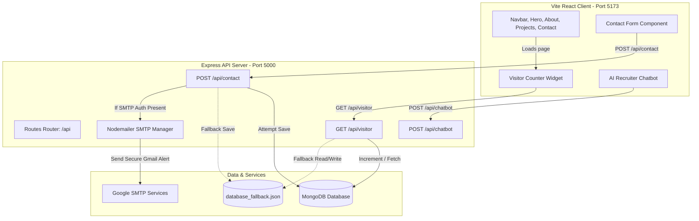

# 🎓 Mansehaj Preet Singh - Developer Portfolio Website

Welcome to the project repository for the personal developer and data science portfolio website of **Mansehaj Preet Singh** (Computer Engineering student at TIET, Patiala, Punjab). 

This document serves as a comprehensive blueprint of the project, detailing the architecture, technology stack, design decisions, database fallback mechanisms, and local setup guide.

---

## 🗺️ System Architecture

The project is structured as a decoupled **Client-Server (MERN-lite)** architecture. The frontend React application communicates with the backend Express API via REST endpoints, allowing contact details to be stored and forwarded, visitor counts to be updated, and chatbot prompts to be resolved dynamically.



---

## 🛠️ Technology Stack

### 1. Frontend
*   **Vite + React.js (v19)**: Selected for lightning-fast Hot Module Replacement (HMR) and lightweight production bundles.
*   **Tailwind CSS (v3)**: Custom responsive grid configurations, spacing scales, and diagonal clip-path helpers.
*   **Lucide React**: Modern, scalable icon sets for social indicators and navigation buttons.
*   **Framer Motion**: Smooth entry and exit transitions, fading content sections on mount, and button micro-interactions.
*   **Canvas Confetti**: Triggers success particle bursts when the user submits a message through the contact form.

### 2. Backend
*   **Express (Node.js)**: Standard server framework handling API routing, CORS handling, and JSON parsing.
*   **Nodemailer**: Connects directly to Google's SMTP servers to forward contact form inquiries to the developer.
*   **Mongoose**: Object-Document Mapping (ODM) layer for database operations in MongoDB.
*   **Dotenv**: Separates sensitive keys (Gmail SMTP tokens, MongoDB URI strings) from the source code.

---

## 🎨 Design Approach & Decisions

### 1. High-Contrast Minimalism
The portfolio layout is heavily inspired by high-contrast print layouts. Rather than overloading the screen with heavy 3D canvases, canvas particles, cursor trails, or startup loaders, the page prioritizes:
*   **Split-Screen Layout**: A diagonal desktop grid divide consisting of a cream-beige accent block on the left and a deep obsidian block on the right.
*   **Strong Typography**: Clear, responsive, and uppercase heading systems.
*   **Real Media Integrations**: Sleek rounded frames displaying the developer's real-life portrait shot in the Hero section and an inline childhood photo block in the About section.

### 2. Failure-Resilient Backend
To ensure the website remains fully interactive even during local inspections where MongoDB is offline, the backend features a custom local storage fallback:
*   Upon startup, the server tries to connect to the local MongoDB database.
*   If the database connection fails or times out, the backend logs a warning and shifts into **Local JSON Fallback Mode**.
*   All visitor counts and contact form submissions are written locally to [database_fallback.json](file:///C:/Users/HP/OneDrive/Desktop/Codes/Projects%20All/Portfolio/backend/database_fallback.json). The API continues returning HTTP `201` and `200` statuses, preventing frontend crashes.

### 3. Google App Password Configuration
The contact form forwards submissions directly to the developer's personal email inbox (`sehajpreetsingh480@gmail.com`). 
*   Uses a **Google App Password** (`yile wjxl jvwd grdw`) to bypass standard multi-factor authentication (MFA) requirements during programmatic SMTP logins.
*   Keeps credentials completely secure inside the [backend/.env](file:///C:/Users/HP/OneDrive/Desktop/Codes/Projects%20All/Portfolio/backend/.env) file (which is gitignored).

---

## 🚀 Setup & Launch Instructions

### 1. Prerequisites
*   [Node.js](https://nodejs.org/) (v18.x or above)
*   *Optional*: Local MongoDB service running.

### 2. Setup Environment Config
Verify that your credentials are set up inside the [backend/.env](file:///C:/Users/HP/OneDrive/Desktop/Codes/Projects%20All/Portfolio/backend/.env) file:
```env
PORT=5000
MONGO_URI=mongodb://localhost:27017/portfolio
EMAIL_USER=sehajpreetsingh480@gmail.com
EMAIL_PASS=yilewjxljvwdgrdw
RECEIVER_EMAIL=sehajpreetsingh480@gmail.com
```

### 3. Installation
To install all required packages across both frontend and backend modules simultaneously, run this command from the root directory:
```bash
npm run install-all
```

### 4. Running the Development Server
Launch the frontend and backend servers concurrently:
```bash
npm run dev
```
*   **Frontend UI**: [http://localhost:5173/](http://localhost:5173/)
*   **Backend Server**: [http://localhost:5000/](http://localhost:5000/)
