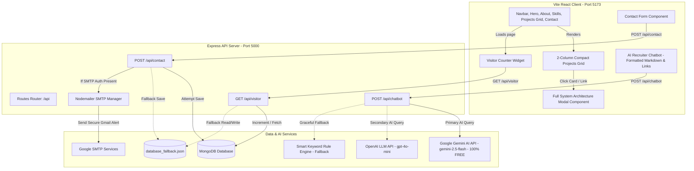

# 🎓 Mansehaj Preet Singh - Developer Portfolio Website

Welcome to the official repository for the personal developer, computer vision, and machine learning portfolio website of **Mansehaj Preet Singh** (Computer Engineering student at Thapar Institute of Engineering & Technology, Patiala, Punjab). 

This document details the architecture, technology stack, project catalog, database fallback mechanisms, and local setup guide.

---

## 🚀 Key Highlights & Featured Capstone Project

### 🌟 Capstone Project: Scenario-Based ODD Safety Framework for Autonomous Vehicles
*   **Perception & Safety Engine**: End-to-end safety evaluation pipeline for autonomous driving on Indian road environments using the IDD-Lite dataset.
*   **Deep Learning Segmentation & Detection**: Integrates PyTorch **SegNet** (3-layer encoder-decoder with Batch Normalization & PyTorch AMP CUDA acceleration) paired with **YOLOv8** target detection.
*   **GPU Weather Perturbation Engine**: Real-time GPU tensor transformations simulating radial fog ($T(x) = e^{-\delta_{ec} \cdot d(x)}$), camera contrast drops, heavy rain, and noise interference.
*   **SAE Level 3 Dynamic ODD Scoring Engine**: Evaluates 18 environmental & road-condition parameters to calculate real-time ODD safety scores (L3 Green $\ge 70$, L2 Orange $40-69$, L1 Red $<40$) and trigger disengagement alerts (reduced false disengagement alarms by 350+ count).
*   **Interactive Spatial Dashboard**: Leaflet.js GeoJSON road network updating spatial automation readiness across city road clusters.

---

## 🗺️ System Architecture

The project is structured as a decoupled **Client-Server (MERN-lite)** architecture with an interactive modal system and multi-tier AI recruiter assistant.


```mermaid
graph TD
    %% Frontend Components
    subgraph Frontend [Vite React Client - Port 5173]
        UI[Navbar, Hero, About, Skills, Projects Grid, Contact]
        CompactGrid[2-Column Compact Projects Grid]
        ArchModal[Full System Architecture Modal Component]
        Form[Contact Form Component]
        VisitorBadge[Visitor Counter Widget]
        ChatWidget[AI Recruiter Chatbot - Formatted Markdown & Links]
    end

    %% Backend Controllers
    subgraph Backend [Express API Server - Port 5000]
        API[Routes Router: /api]
        ContactCtrl[POST /api/contact]
        VisitorCtrl[GET /api/visitor]
        ChatCtrl[POST /api/chatbot]
        Nodemailer[Nodemailer SMTP Manager]
    end

    %% Infrastructure & AI Services
    subgraph Infrastructure [Data & AI Services]
        Gemini[Google Gemini AI API - gemini-2.5-flash - 100% FREE]
        OpenAI[OpenAI LLM API - gpt-4o-mini]
        SmartRules[Smart Keyword Rule Engine - Fallback]
        Mongo[(MongoDB Database)]
        JSONFallback[(database_fallback.json)]
        Gmail[Google SMTP Services]
    end

    %% Connections
    UI -->|Renders| CompactGrid
    CompactGrid -->|Click Card / Link| ArchModal
    UI -->|Loads page| VisitorBadge
    VisitorBadge -->|GET /api/visitor| VisitorCtrl
    Form -->|POST /api/contact| ContactCtrl
    ChatWidget -->|POST /api/chatbot| ChatCtrl

    %% AI Pipeline Logic
    ChatCtrl -->|Primary AI Query| Gemini
    ChatCtrl -.->|Secondary AI Query| OpenAI
    ChatCtrl -.->|Graceful Fallback| SmartRules

    %% DB Logic
    ContactCtrl -->|Attempt Save| Mongo
    ContactCtrl -.->|Fallback Save| JSONFallback
    VisitorCtrl -->|Increment / Fetch| Mongo
    VisitorCtrl -.->|Fallback Read/Write| JSONFallback

    %% SMTP Logic
    ContactCtrl -->|If SMTP Auth Present| Nodemailer
    Nodemailer -->|Send Secure Gmail Alert| Gmail
```

---

## 🛠️ Technology Stack

### 1. Frontend
*   **Vite + React.js (v19)**: Selected for lightning-fast Hot Module Replacement (HMR) and lightweight production bundles.
*   **Tailwind CSS (v3)**: Custom responsive grid configurations, spacing scales, and glassmorphism utilities.
*   **Lucide React**: Modern, scalable icon sets (`Sparkles`, `Cpu`, `Layers`, `Eye`, `Github`, `ChevronDown`).
*   **Framer Motion**: Smooth entry/exit transitions, collapsible inline height animations, and modal popups.
*   **Custom System Architecture Modal**: Dedicated modal dialog (`ProjectModal.jsx`) providing step-by-step layer/module pipelines, performance metrics, and source links.
*   **Canvas Confetti**: Triggers success particle bursts when the user submits a message through the contact form.

### 2. Backend & AI Services
*   **Google Gemini AI API (`gemini-2.5-flash`)**: Primary 100% free AI model providing real-time prompt synthesis and recruiter question answering.
*   **OpenAI LLM API (`gpt-4o-mini`)**: Secondary LLM integration for contextual query synthesis.
*   **Express (Node.js)**: Standard server framework handling API routing, CORS handling, and JSON parsing.
*   **Nodemailer**: Connects directly to Google's SMTP servers to forward contact form inquiries to the developer.
*   **Mongoose**: Object-Document Mapping (ODM) layer for database operations in MongoDB.

---

## 🎨 Design Approach & Features

### 1. Compact 2-Column Grid & Click-to-Open Architecture Modal
*   **Short Format Layout**: Replaced traditional long paragraph vertical stacks with a responsive 2-column compact grid, reducing scroll height by over 60%.
*   **Full System Architecture Modal**: Clicking any project card opens a rich glassmorphic modal displaying step-by-step execution pipelines (Layer 1 to Layer 5), metrics, tech stacks, and source links.
*   **Inline Expand Toggle**: Clicking the chevron toggle allows quick inline expansion directly on the page.

### 2. AI-Powered Recruiter Assistant
*   **System Prompt Context**: Infused with complete developer background (TIET COE Class of 2027, Capstone ODD Framework, *CareerLens*, *MediSmart*, *PowerMRO*, *GameIQ*, Kaggle Expert status).
*   **Multi-Tier Fallback Engine**: Shifts down gracefully: **Google Gemini AI -> OpenAI LLM -> Smart Rule Matching**.

### 3. Failure-Resilient Backend
*   If MongoDB is offline, the backend logs a warning and shifts into **Local JSON Fallback Mode** (`database_fallback.json`), ensuring zero frontend runtime crashes.

---

## 🚀 Setup & Launch Instructions

### 1. Prerequisites
*   [Node.js](https://nodejs.org/) (v18.x or above)
*   *Optional*: Free Gemini API Key from [aistudio.google.com](https://aistudio.google.com).

### 2. Setup Environment Config
Verify credentials inside `backend/.env`:
```env
PORT=5000
MONGO_URI=mongodb://localhost:27017/portfolio
EMAIL_USER=sehajpreetsingh480@gmail.com
EMAIL_PASS=your_app_password
RECEIVER_EMAIL=sehajpreetsingh480@gmail.com

# 100% Free Google Gemini AI Key
GEMINI_API_KEY=your_gemini_api_key
GEMINI_MODEL=gemini-2.5-flash
```

### 3. Installation
```bash
npm run install-all
```

### 4. Running Development Server
```bash
npm run dev
```
*   **Frontend UI**: [http://localhost:5173/](http://localhost:5173/)
*   **Backend Server**: [http://localhost:5000/](http://localhost:5000/)
