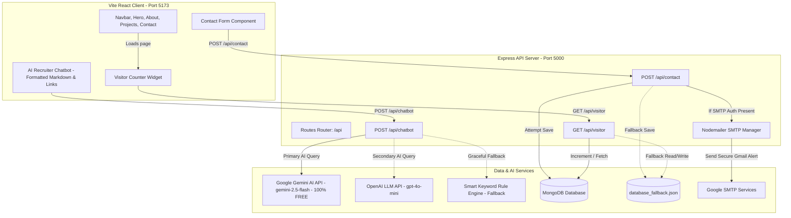

# 🎓 Mansehaj Preet Singh - Developer Portfolio Website

Welcome to the project repository for the personal developer and data science portfolio website of **Mansehaj Preet Singh** (Computer Engineering student at TIET, Patiala, Punjab). 

This document serves as a comprehensive blueprint of the project, detailing the architecture, technology stack, design decisions, database fallback mechanisms, and local setup guide.

---

## 🗺️ System Architecture

The project is structured as a decoupled **Client-Server (MERN-lite)** architecture. The frontend React application communicates with the backend Express API via REST endpoints, allowing contact details to be stored and forwarded, visitor counts to be updated, and chatbot prompts to be resolved dynamically.


```mermaid
graph TD
    %% Frontend Components
    subgraph Frontend [Vite React Client - Port 5173]
        UI[Navbar, Hero, About, Projects, Contact]
        Form[Contact Form Component]
        VisitorBadge[Visitor Counter Widget]
        ChatWidget[AI Recruiter Chatbot - Formatted Markdown & Links]
    end

    %% Backend Controllers
    subgraph Backend [Express API Server - Port 5000]
        API[Routes Router: /api]
        ContactCtrl[POST /api/contact]
        VisitorCtrl[GET /api/visitor]
        ChatCtrl[POST /api/chatbot]
        Nodemailer[Nodemailer SMTP Manager]
    end

    %% Infrastructure & AI Services
    subgraph Infrastructure [Data & AI Services]
        Gemini[Google Gemini AI API - gemini-2.5-flash - 100% FREE]
        OpenAI[OpenAI LLM API - gpt-4o-mini]
        SmartRules[Smart Keyword Rule Engine - Fallback]
        Mongo[(MongoDB Database)]
        JSONFallback[(database_fallback.json)]
        Gmail[Google SMTP Services]
    end

    %% Connections
    UI -->|Loads page| VisitorBadge
    VisitorBadge -->|GET /api/visitor| VisitorCtrl
    Form -->|POST /api/contact| ContactCtrl
    ChatWidget -->|POST /api/chatbot| ChatCtrl

    %% AI Pipeline Logic
    ChatCtrl -->|Primary AI Query| Gemini
    ChatCtrl -.->|Secondary AI Query| OpenAI
    ChatCtrl -.->|Graceful Fallback| SmartRules

    %% DB Logic
    ContactCtrl -->|Attempt Save| Mongo
    ContactCtrl -.->|Fallback Save| JSONFallback
    VisitorCtrl -->|Increment / Fetch| Mongo
    VisitorCtrl -.->|Fallback Read/Write| JSONFallback

    %% SMTP Logic
    ContactCtrl -->|If SMTP Auth Present| Nodemailer
    Nodemailer -->|Send Secure Gmail Alert| Gmail
```

---

## 🛠️ Technology Stack

### 1. Frontend
*   **Vite + React.js (v19)**: Selected for lightning-fast Hot Module Replacement (HMR) and lightweight production bundles.
*   **Tailwind CSS (v3)**: Custom responsive grid configurations, spacing scales, and glassmorphism utilities.
*   **Lucide React**: Modern, scalable icon sets for social indicators and navigation buttons.
*   **Framer Motion**: Smooth entry and exit transitions, floating 3D card stacks, and button micro-interactions.
*   **Custom Markdown & Link Parser**: Parses bold formatting and renders clickable hyperlinks in real-time within the AI assistant.
*   **Canvas Confetti**: Triggers success particle bursts when the user submits a message through the contact form.

### 2. Backend & AI Services
*   **Google Gemini AI API (`gemini-2.5-flash`)**: Primary 100% free AI model providing real-time prompt synthesis and recruiter question answering.
*   **OpenAI LLM API (`gpt-4o-mini`)**: Secondary LLM integration for contextual query synthesis.
*   **Express (Node.js)**: Standard server framework handling API routing, CORS handling, and JSON parsing.
*   **Nodemailer**: Connects directly to Google's SMTP servers to forward contact form inquiries to the developer.
*   **Mongoose**: Object-Document Mapping (ODM) layer for database operations in MongoDB.
*   **Dotenv**: Separates sensitive keys (Gemini API tokens, OpenAI tokens, Gmail SMTP tokens, MongoDB URI strings) from source code.

---

## 🎨 Design Approach & Decisions

### 1. AI-Powered Recruiter Assistant
Constructed an AI-powered conversational assistant that synthesizes complex recruiter/visitor queries into structured, actionable responses in real-time:
*   **System Prompt Context**: Infused with complete developer background (TIET COE Class of 2027, *CareerLens*, *MediSmart*, *PowerMRO*, *GameIQ*, Kaggle Expert status, NVIDIA DLI certification).
*   **Multi-Tier Fallback Engine**: If an API key is missing or quota limits occur, the API seamlessly shifts down: **Google Gemini AI -> OpenAI LLM -> Smart Rule Matching**.
*   **Comfy Glassmorphism UI**: Spacious 480px popup modal with custom markdown formatting, hyperlinked URLs, and badge indicators (`✨ Google Gemini AI`).

### 2. High-Contrast Minimalism & Interactive 3D Card Deck
The portfolio layout combines crisp typography with dynamic interactive media:
*   **Split-Screen Layout**: A diagonal desktop grid divide consisting of a cream-beige accent block on the left and a deep obsidian block on the right.
*   **3D Parallax Hero Deck**: Interactive mouse-tilt photo stack showcasing 3 distinct developer portraits (`pprofile.JPG`, `IMG_5355.JPG`, `IMG_1385.JPG`).
*   **Clean About Section**: Styled typography highlighting academic milestones and technical certifications.

### 3. Failure-Resilient Backend
To ensure the website remains fully interactive even during local inspections where MongoDB is offline, the backend features a custom local storage fallback:
*   Upon startup, the server tries to connect to the local MongoDB database.
*   If the database connection fails or times out, the backend logs a warning and shifts into **Local JSON Fallback Mode**.
*   All visitor counts and contact form submissions are written locally to [database_fallback.json](file:///C:/Users/HP/OneDrive/Desktop/Codes/Projects%20All/Portfolio/backend/database_fallback.json). The API continues returning HTTP `201` and `200` statuses, preventing frontend crashes.

---

## 🚀 Setup & Launch Instructions

### 1. Prerequisites
*   [Node.js](https://nodejs.org/) (v18.x or above)
*   *Optional*: Free Gemini API Key from [aistudio.google.com](https://aistudio.google.com).

### 2. Setup Environment Config
Verify that your credentials are set up inside the [backend/.env](file:///C:/Users/HP/OneDrive/Desktop/Codes/Projects%20All/Portfolio/backend/.env) file:
```env
PORT=5000
MONGO_URI=mongodb://localhost:27017/portfolio
EMAIL_USER=sehajpreetsingh480@gmail.com
EMAIL_PASS=your_app_password
RECEIVER_EMAIL=sehajpreetsingh480@gmail.com

# 100% Free Google Gemini AI Key (from https://aistudio.google.com)
GEMINI_API_KEY=your_gemini_api_key
GEMINI_MODEL=gemini-2.5-flash

# Optional OpenAI Key
OPENAI_API_KEY=your_openai_api_key
```

### 3. Installation
To install all required packages across both frontend and backend modules simultaneously, run this command from the root directory:
```bash
npm run install-all
```

### 4. Running the Development Server
Launch the frontend and backend servers concurrently:
```bash
npm run dev
```
*   **Frontend UI**: [http://localhost:5173/](http://localhost:5173/)
*   **Backend Server**: [http://localhost:5000/](http://localhost:5000/)
